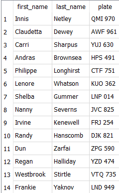
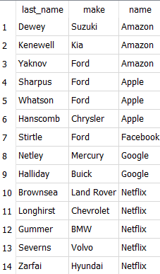
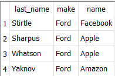
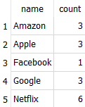
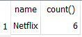
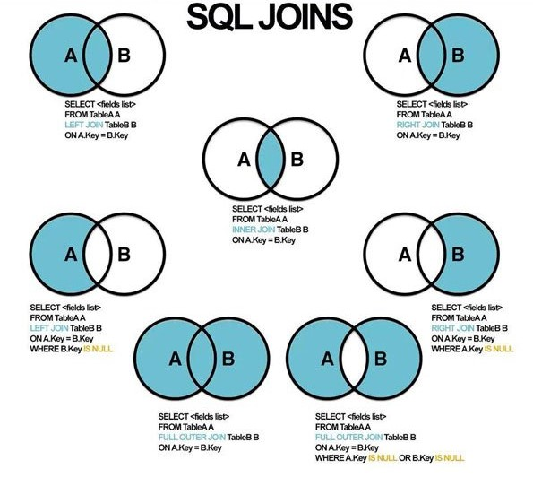
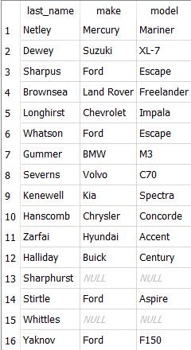
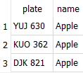
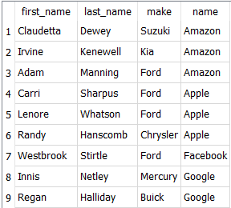

# Duomenų išrinkimas iš kelių lentelių

Yra du pagrindiniai būdai jungti duomenis iš skirtingų lentelių, vienas iš jų yra naudojant WHERE:

```sql
SELECT <stulpeliai>
FROM <lentelė1>, <lentelė2>
WHERE <jungimo sąlyga> [AND <paieškos sąlyga>];
```

Kitas būdas naudoja JOIN:

```sql
SELECT <stulpeliai>
FROM <lentelė1>
JOIN <lentelė 2> ON <jungimo sąlyga> [WHERE <paieškos sąlyga>];
```

## WHERE
```sql
SELECT person.first_name, person.last_name, car.plate
FROM person, car
WHERE person.car_id = car.id
```



užklausa iš 3-jų lentelių:
```sql
SELECT last_name, make, name
FROM person, car, company
WHERE person.car_id = car.id AND person.company_id = company.id
ORDER BY name
```



Pavyzdys su papildomomis sąlygomis:

```sql
SELECT last_name, make, name
FROM person, car, company
WHERE person.car_id = car.id 
AND person.company_id = company.id
AND make = "Ford"
ORDER BY name DESC;
```



## JOIN

Atlikime tuos pačius veiksmus su JOIN:

```sql
SELECT person.first_name, person.last_name, car.plate
FROM person
JOIN car ON person.car_id = car.id
```


```sql
SELECT last_name, make, name
FROM person
JOIN car ON person.car_id = car.id
JOIN company ON person.company_id = company.id
ORDER BY name
```


```sql
SELECT last_name, make, name
FROM person
JOIN car ON person.car_id = car.id
JOIN company ON person.company_id = company.id
WHERE make = "Ford"
ORDER BY name DESC
```


Kiek sudėtingesnis - suskaičiuokime, kiek kokioje kompanijoje dirba žmonių:

```sql
SELECT company.name, count(*) as count
FROM person
JOIN company ON person.company_id = company.id
GROUP BY company.name
```



Atrinkime tik tas kompanijas, kuriose dirba daugiau, negu 3 darbuotojai:

```sql
SELECT company.name, count()
FROM person
JOIN company ON person.company_id = company.id
GROUP BY company.name
HAVING count() > 3
```


## JOIN rūšys



* INNER JOIN yra standartinis JOIN, kurį naudojome iki šiol
* LEFT JOIN - jungimo rezultatas yra papildomas kairiosios
(pirmosios) lentelės nesujungiamomis eilutėmis.
* RIGHT JOIN - jungimo rezultatas yra papildomas dešiniosios
(antrosios) lentelės nesujungiamomis eilutėmis.
* FULL OUTER JOIN - papildoma abiejų lentelių eilutėmis
nesujungiamomis eilutėmis.

Populiariausias apart standartinio JOIN yra INNER JOIN, jį ir panagrinėsime:

```sql
SELECT last_name, make, model
FROM person
LEFT JOIN car ON person.car_id = car.id
```



Rezultate matome, kad sujungtos buvo ir tos eilutės, kur *person* neturi car_id.

Kokie yra Apple automobilių numeriai?

```sql
SELECT plate, name
FROM person
LEFT JOIN car ON person.car_id = car.id
JOIN company ON person.company_id = company.id
WHERE company.name = "Apple"
```



Išrinkime žmones, mašinų markes ir kontorų pavadinimus tik iš tų kontorų, kuriose dirba ne daugiau kaip 3 žmonės iš sąrašo:

```sql
SELECT first_name, last_name, make, company.name
FROM person
JOIN company on person.company_id = company.id
JOIN car on person.car_id = car.id
WHERE person.company_id IN

(SELECT company_id 
FROM person
GROUP BY company_id
HAVING count() <= 3)
ORDER BY company.name
```



# Užduotys
Parsisiųskite lentelę "darbuotojai3.db", atsidarykite ją programoje DB Browser for SQLite ir skiltyje "Execute SQL" atlikite šias SQL užklausas:

1. Išrinkite darbuotojų vardus ir pavardes kartu su projekto pavadinimu, kuriame jie dirba.
2. Išsirinkite darbuotojų dirbančių projekte Galerija vardus, pavardes ir projekto pavadinimą.
3. Išrinkite visus projekto Projektų valdymas vykdytojus dirbančius Pardavimų skyriuje.
4. Išrinkite visas moteris, dirbančias projekte Projektų valdymas ir išveskite į ekraną jų vardus, pavardes ir projekto pavadinimą.
5. Išrinkite skyrių pavadinimus su juose dirbančių darbuotojų skaičiumi.
6. Apribokite #5 užklausos rezultatą taip, kad rodytų tik tuos skyrius kur dirba bent 5 darbuotojai.
7. Išrinkite darbuotojus (vardus, pavardes, pareigas) kartu su skyrių, kuriuose jie dirba pavadinimais, tačiau nesančius tų skyrių vadovais.
8. Sukurkite naują įrašą lentelėje “DARBUOTOJAS” (asmens kodas: 38807117896, vardas: Pranas, pavardė:Logis, Dirba nuo: 2009-11-12, visa kita - Null).
9. Išrinkite darbuotojų vardus, pavardes ir skyriaus pavadinimą. Rodykite, net ir tuos darbuotojus, kurie nedirba jokiame skyriuje (skyriaus pavadinimą pasiimkite iš lentelės SKYRIUS).
10. 1# punkto užklausą pataisykite taip, kad rodytų tik tuos vardus ir projektų pavadinimus kuriuose dirba daugiau nei 4 darbuotojai.
11. Naujame stulpeyje parodyti kiekvieno darbuotojo bazinio atlyginimo ir priedų sumą.
12. Parodyti bendrą atlyginimų, priedų sumą, vidutinį, maksimalų, minimalų atlyginimą.
