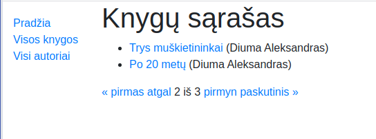
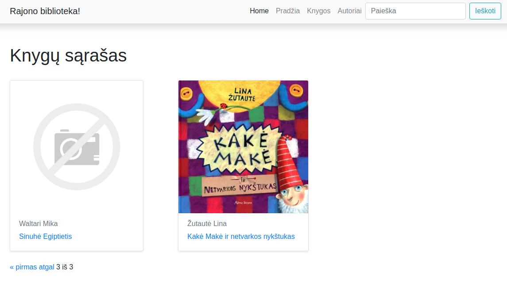

# Puslapiavimas

Programoje prisikaupus daug informacijos, darosi nepatogu naudotis, kuomet ji atvaizduojama viename naršyklės puslapyje. Įprastai tokia problema sprendžiama išskirstant turinį per keletą puslapių (*pagination*). Pamėginkime tai įgyvendinti su *BookListView*.

views.py:
```python
class BookListView(generic.ListView):
    model = Book
    paginate_by = 2
    template_name = 'book_list.html'
```

Taip pat reikia pakoreguoti šabloną, pačioje pabaigoje, prieš *endblock*:

```html
  <div class="pagination">
    <span class="step-links">
        
            <a href="?page=1">&laquo; pirmas</a>
            <a href="?page={{ page_obj.previous_page_number }}">atgal</a>
        

        <span class="current">
            {{ page_obj.number }} iš {{ page_obj.paginator.num_pages }}
        </span>

        
            <a href="?page={{ page_obj.next_page_number }}">pirmyn</a>
            <a href="?page={{ page_obj.paginator.num_pages }}">paskutinis &raquo;</a>
        
    </span>
</div>       

```
Logika tokia:
 1. Jeigu puslapio objektas turi puslapių prieš tai (naudojame metodą *has_previous*) - atvaizduokime nuorodą *pirmas* (kuri nukreipia į patį pirmą puslapį) ir nuorodą "atgal" - ji nukreips į puslapį, esantį prieš tai.

 2. Naudodami metodus *number* ir *paginator.num_pages* suformuojame užrašą centre(pvz. 2 iš 3)

 3. Analogiškai pirmam punktui, tik atvirkščiai, suformuojame nuorodas pirmyn ir paskutinis.  



Prireikus puslapiuoti funkcija parašytą *view'są*, darysime taip:

```python
from django.core.paginator import Paginator

def authors(request):   
    paginator = Paginator(Author.objects.all(), 2)
    page_number = request.GET.get('page')
    authors = paginator.get_page(page_number)
    context = {
        'authors': authors
    }   
    return render(request, 'authors.html', context=context)
```

na, o šablone galime pritaikyti taip pat kiek kitokį variantą:

```html
<div class="container puslapiai">
    <nav aria-label="...">
        
            <ul class="pagination pagination-sm justify-content-end">
                
                    
                        <li class="page-item active">
                            <a class="page-link">{{ i }}</a>
                        </li>
                    
                        <li class="page-item">
                            <a class="page-link" href="?page={{ i }}">{{ i }}</a>
                        </li>
                    
                
            </ul>
        
    </nav>
</div>
```

vaizdas bus toks:


# Paieška

Tai bus ir nedidelė įžanga į formas, kadangi search taip pat yra forma. 

papildykime navigaciją paieškos laukeliu:
```html
<li>
    <form action="" method="get" class="form-inline my-2 my-md-0">
    <input name="query" class="form-control" type="text" placeholder="Paieška">
    </form>
</li>
```

papildykime *urlslist*'ą nauju endpoint'u:

```python
path('search/', views.search, name='search'),
```

sukurkime naują funkciją *search views.py*:

```python
from django.db.models import Q

def search(request):
    """
    paprasta paieška. query ima informaciją iš paieškos laukelio,
    search_results prafiltruoja pagal įvestą tekstą knygų pavadinimus ir aprašymus.
    Icontains nuo contains skiriasi tuo, kad icontains ignoruoja ar raidės 
    didžiosios/mažosios.
    """
    query = request.GET.get('query')
    search_results = Book.objects.filter(Q(title__icontains=query) | Q(summary__icontains=query))
    return render(request, 'search.html', {'books': search_results, 'query': query})
```
Apie Q daugiau informacijos rasite [dokumentacijoje](https://docs.djangoproject.com/en/3.2/topics/db/queries/#complex-lookups-with-q-objects).
Sukurkime naują šabloną *search.html*:

```html



  <h1>Paieškos pagal "{{query}}" rezultatai:</h1>
  </br>
  
  <ul>
    
      <li>
        <a href="{{ book.id }}">{{ book.title }}</a> ({{book.author}})
      </li>
    
  </ul>
  
    <p>Oops. Nieko neradome :(</p>
  

  
```


Paminėtina tai, jog patogumo dėlei mūsų naudojama SQLite numatytoji duomenų bazė nepalaiko kai kurių funkcijų, pvz 'šveplos' paieškos čia nepadarysite, o tarkime su Postgres - be problemų. Turėkite omeny, kad SQLite produkcijai apskritai nelabai tinkamas variantas. Pvz, esant dideliam konkuruojančių užklausų kiekiui ji mėgsta užsirakinti, programa lūžta. Tačiau ji yra puikus variantas modeliavimui ir prototipavimui.  

# Nuotraukos

Nuotraukas django gali saugoti duomenų bazėje, arba diske. Saugoti nuotraukas duomenų bazėje nerekomenduojama, kadangi ilgainiui tai apsunkina duomenų bazės greitą veikimą. Dažniausiai, ypač programai 'užaugus', mes norėsime kuo greitesnės duombazės. Todėl pamėginkime išspręsti nuotraukų klausimą teisingai. Pradėsime nuo settings.py:

```python
# media folder settings
MEDIA_ROOT = os.path.join(BASE_DIR, 'library/media')

MEDIA_URL = '/media/'
# print(MEDIA_ROOT) - nevenkite padebuginti, bus lengviau nepasiklysti django filesystem džiunglėse
```

dabar, pagrindiniame (projekto) kataloge, atidarykite *urls.py* ir pridėkite eilutę prie pagrindinio sąrašo:

```python
urlpatterns = [
    path('library/', include('library.urls')),
    path('admin/', admin.site.urls),
    path('', RedirectView.as_view(url='library/', permanent=True)),
] + (static(settings.STATIC_URL, document_root=settings.STATIC_ROOT) +  
    static(settings.MEDIA_URL, document_root=settings.MEDIA_ROOT))
```

papildykime *Book* modelį taip, kad jis galėtų turėti paveikslėlius:

```python
cover = models.ImageField('Viršelis', upload_to='covers', null=True)
```
nuotraukų procesavimui django naudoja pillow biblioteką, todėl:
```bash
$ pip install pillow
```

Dabar jau galime pridėti nuotraukas per *admin panel*. jeigu atkrepėte dėmesį, 
failų struktūroje atsirado naujas katalogas 'media' o jame 'covers'.

perrašėme *book_list.html*:

```html
 
    <h1>Knygų sąrašas</h1></br>
    
    <div class="row">
      
        <div class="col-md-4 d-flex align-items-stretch">
          <div class="card mb-4 shadow-sm">
            
              
            
              
            
            <div class="card-body">
              <h6 class="card-subtitle mb-2 text-muted">{{ book.author }}</h6>
              <p class="card-text"><a href="{{ book.id }}">{{ book.title }}</a></p>
            </div>
          </div>
        </div>
      
    </div>
    
      <p>Bibliotekoje knygų nėra.</p>
    
```

Tuo pačiu šiek tiek pagyvinome navigaciją, ir turime tokį vaizdą:



pakeistas base.html kodas:
```html
<!DOCTYPE html>
<html lang="en">
<head>
  <title>Biblioteka</title>
  <meta charset="utf-8">
  <meta name="viewport" content="width=device-width, initial-scale=1">
  <link rel="stylesheet" href="https://stackpath.bootstrapcdn.com/bootstrap/4.1.3/css/bootstrap.min.css" integrity="sha384-MCw98/SFnGE8fJT3GXwEOngsV7Zt27NXFoaoApmYm81iuXoPkFOJwJ8ERdknLPMO" crossorigin="anonymous">
  <link rel="stylesheet" href="https://cdn.jsdelivr.net/npm/bootstrap@5.2.3/dist/css/bootstrap.min.css" integrity="sha384-rbsA2VBKQhggwzxH7pPCaAqO46MgnOM80zW1RWuH61DGLwZJEdK2Kadq2F9CUG65" crossorigin="anonymous">
    <!-- Add additional CSS in static file -->
  
  <link rel="stylesheet" href="">
</head>
<body>
    <nav class="navbar navbar-expand-lg navbar-light bg-light">
      <div class="container-fluid">
        <a class="navbar-brand">Rajono biblioteka</a>
        <ul class="navbar-nav mx-2">
          <li class="nav-item active"><a class="nav-link" href="">Pradžia</a></li>
          <li class="nav-item active"><a class="nav-link" href="">Visos knygos</a></li>
          <li class="nav-item active"><a class="nav-link" href="">Visi autoriai</a></li>
        </ul>
        <form class="form-inline my-2 my-lg-0" action="" method="get">
          <input class="form-control me-2" name="query" class="form-control" type="text" placeholder="Paieška">
          <button class="btn btn-outline-success" type="submit">Search</button>
        </form>
      </div>
    </nav>
      <div class="col-sm-10 ">
        
        
      </div>
</body>
</html>
```

Parodykime viršelius ir atskirų knygų aprašymuose. Prieš pavadinimo bloką tiesiog įterpkime: 

```html

```


 ## Užduotis
Tęsti kurti Django užduotį – [Autoservisas](https://github.com/StasysC/Python-2lvl/blob/master/Django/Autoservisas.md):
* Padaryti, kad įrašai užsakymų puslapyje būtų puslapiuojami (per klasę).
* Padaryti, kad įrašai automobilių puslapyje būtų puslapiuojami (per funkciją).
* Puslapyje įdėti paieškos laukelį, kuris ieškotų automobilių pagal savininką, modelį, valstybinį numerį, VIN kodą
* Padaryti, kad prie automobilio įrašo galima būtų pridėti nuotrauką ir ji būtų atvaizduojama automobilių puslapyje
