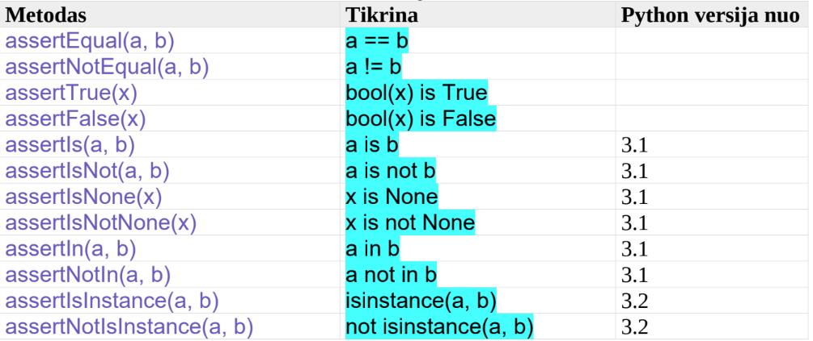

# UNIT testai

## Kaip patikrinti, ar programa teisingai veikia?

### Failas: keliamieji.py
```python
def ar_keliamieji(metai):
    if (metai % 400 == 0) or (metai % 100 != 0 and metai % 4 == 0):
        return("Keliamieji")
    else:
        return("Nekeliamieji")

print(ar_keliamieji(2000))
print(ar_keliamieji(2020))
print(ar_keliamieji(2100))

# Keliamieji
# Keliamieji
# Nekeliamieji
```
## Kaip ištestuoti programą UNIT testų pagalba
### Failas: test_keliamieji.py:

```python
import unittest
from keliamieji import *

class TestKeliamieji(unittest.TestCase):

    def test_ar_keliamieji(self):
        rezultatas = ar_keliamieji(2000)
        lukestis = "Keliamieji"
        self.assertEqual(lukestis, rezultatas)

# Ran 1 test in 0.007s
# OK
```
## Testo paleidimas komandinėje eilutėje (cmd):
```bash
python -m unittest test_keliamieji.py

.
----------------------------------------------------------------------
Ran 1 test in 0.000s

OK
```
## Testo paleidimas tiesiogiai:
### Faile test_keliamieji.py prirašyti:
```python
if __name__ == '__main__':
    unittest.main()
```
## Komandinėje eilutėje:
```bash
python test_keliamieji.py
```
**Pastaba**: paleidžiant testą PyCharm programoje, to nereikia
## Pats testas turi būti teisingas:
### Failas: test_keliamieji.py:
```python
import unittest
from keliamieji import ar_keliamieji
class TestKeliamieji(unittest.TestCase):
    def test_ar_keliamieji(self):
        self.assertEqual("Keliamieji", ar_keliamieji(2000))
        self.assertEqual("Keliamieji", ar_keliamieji(2020))
        self.assertEqual("Keliamieji", ar_keliamieji(2100))


# Ran 1 test in 0.003s

# FAILED (failures=1)


# Nekeliamieji != Keliamieji

# Expected :Keliamieji
# Actual   :Nekeliamieji
```
## Pataisome:
```python
import unittest
from keliamieji import ar_keliamieji
class TestKeliamieji(unittest.TestCase):
    def test_ar_keliamieji(self):
        self.assertEqual("Keliamieji", ar_keliamieji(2000))
        self.assertEqual("Keliamieji", ar_keliamieji(2020))
        self.assertEqual("Nekeliamieji", ar_keliamieji(2100))


# Ran 1 test in 0.002s

# OK
```

```python

```

```python

```

```python

```
